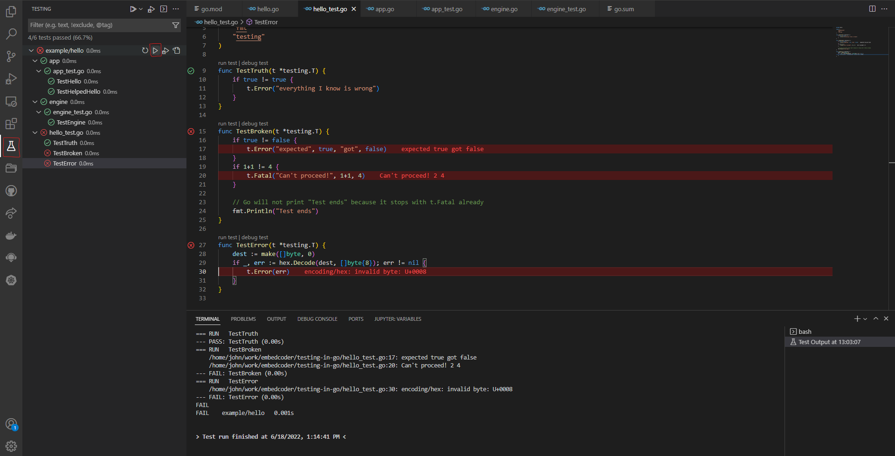

<h3 align="center">Basic testing in Go</h3>

<div align="center">

[]()
[](https://github.com/kylelobo/The-Documentation-Compendium/pulls)
[](/LICENSE)

</div>

---

<p align="center"> Some basic testing in Go.
    <br> 
</p>

## 📝 Table of Contents

- [About](#about)
- [Getting Started](#getting_started)
- [Running the tests](#tests)
- [Bucket list](#bucket_list)

## 🧐 About <a name = "about"></a>

Refer: [Testing in Go - Nick Gauthier](https://www.cloudbees.com/blog/testing-in-go)

## 🏁 Getting Started <a name = "getting_started"></a>

### Prerequisites

Install necessary modules

```
go mod tidy
```

## ⚙️ Running the tests <a name="tests"></a>

### The first basic test

Run the first basic test with hello package.

```
go test -v .
```

### Run other the test cases

Go into each sub folder to test the appropriate test cases.

Ex:

```
cd app
go test -v .
```

### Run test by VS code

Run the test by mouse select on the UI.

All the test cases can be run all in once by select the run test button on example/hello in the left sidebar. It's able to run individual test case by selecting in that left sidebar as well.

</a>

## 📃 Bucket list <a name = "bucket_list"></a>

-
-
-
